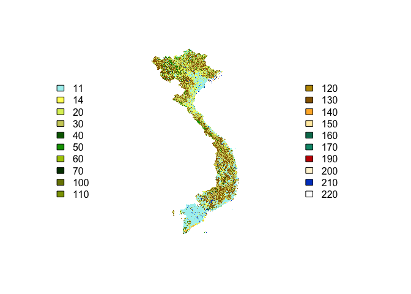
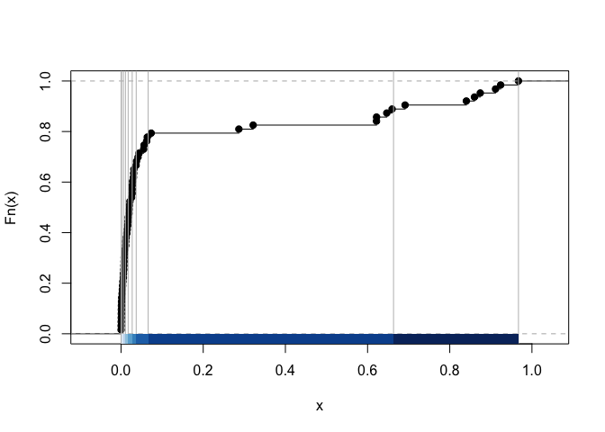
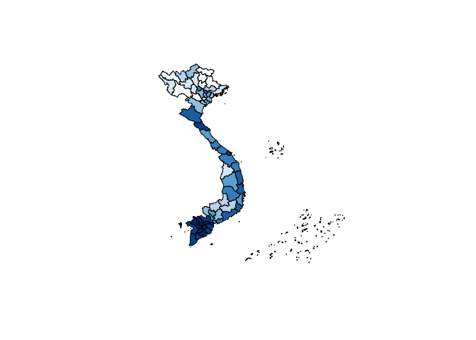
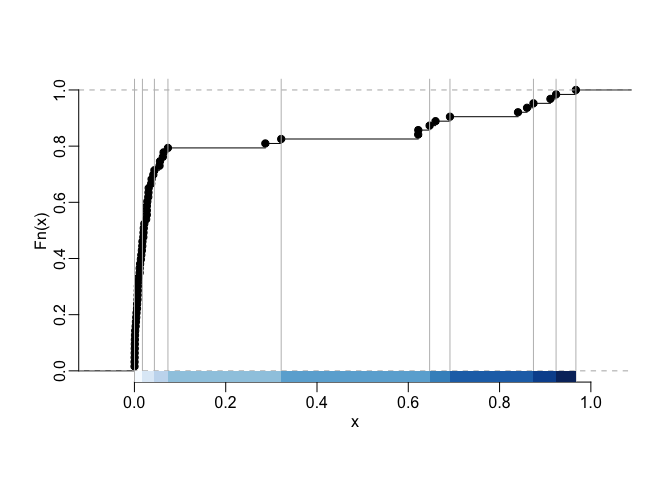
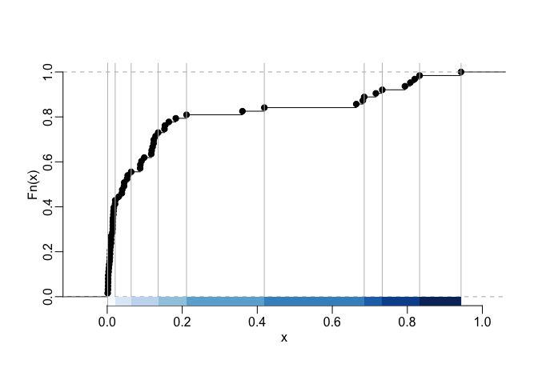
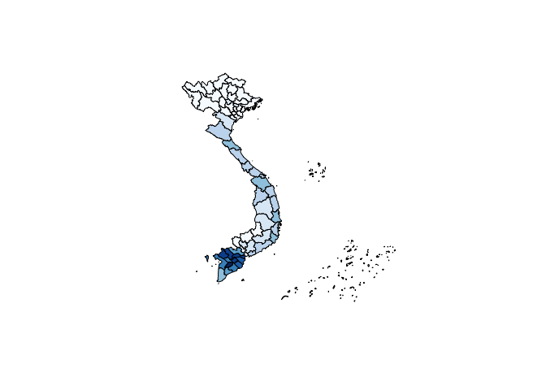
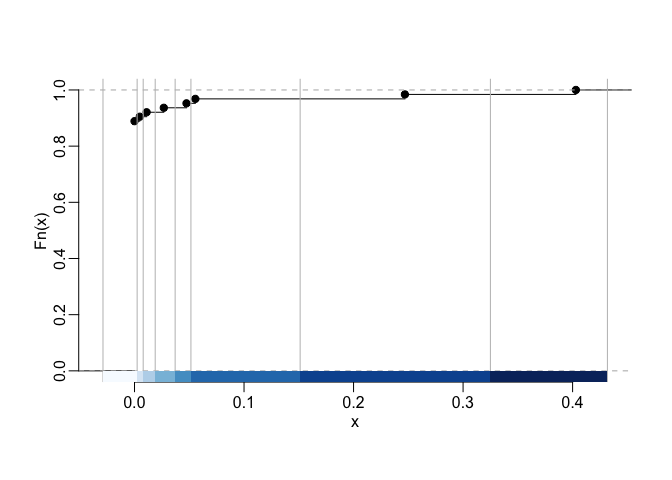
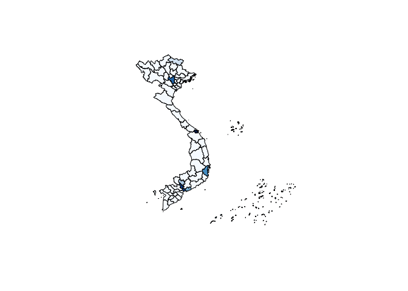

<!-- README.md is generated from README.Rmd. Please edit that file -->

# globcoverVN

<!-- badges: start -->

[](https://ci.appveyor.com/project/epix-project/globcoverVN)
[](https://travis-ci.org/epix-project/globcoverVN)
[](https://codecov.io/gh/epix-project/globcoverVN?branch=master)
<!-- badges: end -->

The `globcoverVN` package contains land cover data for Vietnam from the
[GlobCover](http://due.esrin.esa.int/page_globcover.php) project. It is
made of a `rasterLayer` object that can be loaded with the `getgcvn`
function and of the `SpatialPolygonsDataFrame` `provinces` object that
contains, for each province, the percentage of land cover of each type.
Below we describe in detail these data and their use.

## Installation and loading

You can install `globcoverVN` from
[GitHub](https://github.com/choisy/globcoverVN) with:

``` r
# install.packages("devtools")
devtools::install_github("choisy/globcoverVN", build_vignettes = TRUE)
```

Once installed, you can load the package:

``` r
library(globcoverVN)
```

## Usage examples

The raster file can be loaded by the `getgcvn` function:

``` r
landcover <- getgcvn()
#> Loading required package: raster
#> Loading required package: sp
```

The code of the different categories of land cover can be seen with the
`legend` method:

``` r
show_legend(landcover)
#>  11 : Post-flooding or irrigated croplands (or aquatic)
#>  14 : Rainfed croplands
#>  20 : Mosaic cropland (50-70%) / vegetation (grassland/shrubland/forest) (20-50%)
#>  30 : Mosaic vegetation (grassland/shrubland/forest) (50-70%) / cropland (20-50%)
#>  40 : Closed to open (>15%) broadleaved evergreen or semi-deciduous forest (>5m)
#>  50 : Closed (>40%) broadleaved deciduous forest (>5m)
#>  60 : Open (15-40%) broadleaved deciduous forest/woodland (>5m)
#>  70 : Closed (>40%) needleleaved evergreen forest (>5m)
#> 100 : Closed to open (>15%) mixed broadleaved and needleleaved forest (>5m)
#> 110 : Mosaic forest or shrubland (50-70%) / grassland (20-50%)
#> 120 : Mosaic grassland (50-70%) / forest or shrubland (20-50%)
#> 130 : Closed to open (>15%) (broadleaved or needleleaved, evergreen or deciduous) shrubland (<5m)
#> 140 : Closed to open (>15%) herbaceous vegetation (grassland, savannas or lichens/mosses)
#> 150 : Sparse (<15%) vegetation
#> 160 : Closed to open (>15%) broadleaved forest regularly flooded (semi-permanently or temporarily) - Fresh or brackish water
#> 170 : Closed (>40%) broadleaved forest or shrubland permanently flooded - Saline or brackish water
#> 190 : Artificial surfaces and associated areas (Urban areas >50%)
#> 200 : Bare areas
#> 210 : Water bodies
#> 220 : Permanent snow and ice
```

The output can also be assigned to an data frame:

``` r
leg <- show_legend(landcover)
#>  11 : Post-flooding or irrigated croplands (or aquatic)
#>  14 : Rainfed croplands
#>  20 : Mosaic cropland (50-70%) / vegetation (grassland/shrubland/forest) (20-50%)
#>  30 : Mosaic vegetation (grassland/shrubland/forest) (50-70%) / cropland (20-50%)
#>  40 : Closed to open (>15%) broadleaved evergreen or semi-deciduous forest (>5m)
#>  50 : Closed (>40%) broadleaved deciduous forest (>5m)
#>  60 : Open (15-40%) broadleaved deciduous forest/woodland (>5m)
#>  70 : Closed (>40%) needleleaved evergreen forest (>5m)
#> 100 : Closed to open (>15%) mixed broadleaved and needleleaved forest (>5m)
#> 110 : Mosaic forest or shrubland (50-70%) / grassland (20-50%)
#> 120 : Mosaic grassland (50-70%) / forest or shrubland (20-50%)
#> 130 : Closed to open (>15%) (broadleaved or needleleaved, evergreen or deciduous) shrubland (<5m)
#> 140 : Closed to open (>15%) herbaceous vegetation (grassland, savannas or lichens/mosses)
#> 150 : Sparse (<15%) vegetation
#> 160 : Closed to open (>15%) broadleaved forest regularly flooded (semi-permanently or temporarily) - Fresh or brackish water
#> 170 : Closed (>40%) broadleaved forest or shrubland permanently flooded - Saline or brackish water
#> 190 : Artificial surfaces and associated areas (Urban areas >50%)
#> 200 : Bare areas
#> 210 : Water bodies
#> 220 : Permanent snow and ice
```

And then:

``` r
str(leg)
#> 'data.frame':    20 obs. of  3 variables:
#>  $ landtype: chr  "Post-flooding or irrigated croplands (or aquatic)" "Rainfed croplands" "Mosaic cropland (50-70%) / vegetation (grassland/shrubland/forest) (20-50%)" "Mosaic vegetation (grassland/shrubland/forest) (50-70%) / cropland (20-50%)" ...
#>  $ code    : num  11 14 20 30 40 50 60 70 100 110 ...
#>  $ color   : chr  "#AAF0F0" "#FFFF64" "#DCF064" "#CDCD66" ...
```

This raster file can be plotted as follow:

``` r
colors <- leg$color
plot(landcover, col = colors, legend = FALSE, axes = FALSE)
l <- length(colors)
x <- ceiling(l / 2)
sel1 <- 1:x
sel2 <- (x + 1):l
leg1 <- leg$code[sel1]
leg2 <- leg$code[sel2]
col1 <- colors[sel1]
col2 <- colors[sel2]
legend("left", legend = leg1, fill = col1, bty = "n")
legend("right", legend = leg2, fill = col2, bty = "n")
```



``` r
show_legend(landcover)
#>  11 : Post-flooding or irrigated croplands (or aquatic)
#>  14 : Rainfed croplands
#>  20 : Mosaic cropland (50-70%) / vegetation (grassland/shrubland/forest) (20-50%)
#>  30 : Mosaic vegetation (grassland/shrubland/forest) (50-70%) / cropland (20-50%)
#>  40 : Closed to open (>15%) broadleaved evergreen or semi-deciduous forest (>5m)
#>  50 : Closed (>40%) broadleaved deciduous forest (>5m)
#>  60 : Open (15-40%) broadleaved deciduous forest/woodland (>5m)
#>  70 : Closed (>40%) needleleaved evergreen forest (>5m)
#> 100 : Closed to open (>15%) mixed broadleaved and needleleaved forest (>5m)
#> 110 : Mosaic forest or shrubland (50-70%) / grassland (20-50%)
#> 120 : Mosaic grassland (50-70%) / forest or shrubland (20-50%)
#> 130 : Closed to open (>15%) (broadleaved or needleleaved, evergreen or deciduous) shrubland (<5m)
#> 140 : Closed to open (>15%) herbaceous vegetation (grassland, savannas or lichens/mosses)
#> 150 : Sparse (<15%) vegetation
#> 160 : Closed to open (>15%) broadleaved forest regularly flooded (semi-permanently or temporarily) - Fresh or brackish water
#> 170 : Closed (>40%) broadleaved forest or shrubland permanently flooded - Saline or brackish water
#> 190 : Artificial surfaces and associated areas (Urban areas >50%)
#> 200 : Bare areas
#> 210 : Water bodies
#> 220 : Permanent snow and ice
```

In addition to this `RasterLayer` resource, the package also provides
`SpatialPolygonsDataFrame` resources that contains the polygons of the
provinces of Vietnam at different points in time together with the
proportions of the different categories of land cover for each province,
in the form of attributes. These `SpatialPolygonsDataFrame` resources
can be retrieved thanks to the `getlandcover` function:

``` r
prov2008 <- getlandcover(2008)
str(prov2008@data)
#> 'data.frame':    63 obs. of  41 variables:
#>  $ province: chr  "An Giang" "Ba Ria - Vung Tau" "Bac Giang" "Bac Kan" ...
#>  $ 11      : num  0.911396 0.03667 0.007003 0.000273 0.321547 ...
#>  $ 14      : num  0.0213 0.37934 0.23353 0.00627 0.19674 ...
#>  $ 20      : num  0.01063 0.07835 0.12403 0.00878 0.13278 ...
#>  $ 30      : num  0.00514 0.01746 0.19113 0.0605 0.0666 ...
#>  $ 40      : num  0.0021 0.15572 0.20113 0.46956 0.00809 ...
#>  $ 50      : num  7.96e-05 1.02e-03 2.73e-04 1.82e-05 4.96e-04 ...
#>  $ 60      : num  1.54e-03 6.52e-03 1.55e-03 4.56e-03 7.63e-05 ...
#>  $ 70      : num  0.000424 0.006371 0.014393 0.040316 0.022924 ...
#>  $ 100     : num  0.000769 0.047807 0.034197 0.040535 0.065225 ...
#>  $ 110     : num  1.06e-04 0.00 4.55e-05 3.64e-05 1.87e-03 ...
#>  $ 120     : num  5.30e-05 0.00 4.55e-05 3.64e-05 2.52e-03 ...
#>  $ 130     : num  0.0137 0.1982 0.1794 0.3686 0.0437 ...
#>  $ 140     : num  0.00289 0.03414 0.00487 0 0.1364 ...
#>  $ 150     : num  0 0.000535 0 0 0 ...
#>  $ 160     : num  0 0 0 0 0 ...
#>  $ 170     : num  0 0.021545 0 0 0.000267 ...
#>  $ 190     : num  0 0.00199 0 0 0 ...
#>  $ 200     : num  7.96e-05 2.58e-03 9.09e-05 0.00 1.91e-04 ...
#>  $ 210     : num  0.029756 0.011721 0.008276 0.000546 0.000572 ...
#>  $ 220     : num  0 0 0 0 0 ...
#>  $ 11_pop  : num  0.8196 0.1236 0.0213 0.0104 0.3604 ...
#>  $ 14_pop  : num  0.0408 0.3648 0.447 0.0333 0.2064 ...
#>  $ 20_pop  : num  0.0454 0.1517 0.2086 0.0491 0.1534 ...
#>  $ 30_pop  : num  0.0127 0.065 0.1987 0.1036 0.0537 ...
#>  $ 40_pop  : num  0.00326 0.05868 0.03871 0.38485 0.00533 ...
#>  $ 50_pop  : num  1.67e-04 9.14e-04 3.03e-04 1.72e-05 3.71e-04 ...
#>  $ 60_pop  : num  0.001807 0.007032 0.003118 0.002707 0.000123 ...
#>  $ 70_pop  : num  0.000239 0.002357 0.001826 0.032272 0.014596 ...
#>  $ 100_pop : num  0.000376 0.02007 0.008279 0.051629 0.040319 ...
#>  $ 110_pop : num  7.09e-05 0.00 3.06e-05 1.33e-05 1.39e-03 ...
#>  $ 120_pop : num  1.83e-05 0.00 7.30e-06 3.07e-05 1.58e-03 ...
#>  $ 130_pop : num  0.0192 0.0814 0.0588 0.3318 0.0343 ...
#>  $ 140_pop : num  0.0123 0.04755 0.00652 0 0.12702 ...
#>  $ 150_pop : num  0 0.0013 0 0 0 ...
#>  $ 160_pop : num  0 0 0 0 0 ...
#>  $ 170_pop : num  0 0.006013 0 0 0.000152 ...
#>  $ 190_pop : num  0 0.0267 0 0 0 ...
#>  $ 200_pop : num  0.003619 0.035835 0.00019 0 0.000237 ...
#>  $ 210_pop : num  0.040463 0.007022 0.006633 0.000406 0.00072 ...
#>  $ 220_pop : num  0 0 0 0 0 0 0 0 0 0 ...
```

The variables whose names end with `_pop` correspond to percentages of
land cover when correcting for the local human population density as
available from the `worldpopVN` package. The user interested in seeing
how this is computed can have a look at the `data_creation` script in
the `data-raw` folder of the package sources. This script makes use of
the `lcsummary` and `lcpopsummary` non-exported functions that are in
the `lcsummary.R` and `lcpopsummary.R` files in the `R` folder of the
package sources. One can verify that the percentages of land cover sum
to 1:

``` r
rowSums(prov2008@data[, 2:21])
#>  1  6  2  3  4  5  7  8  9 10 11 12 13 14 17 15 16 18 19 20 21 22 25 26 27 
#>  1  1  1  1  1  1  1  1  1  1  1  1  1  1  1  1  1  1  1  1  1  1  1  1  1 
#> 23 24 28 30 29 31 32 33 34 35 36 37 38 39 40 41 42 43 44 45 46 47 48 49 50 
#>  1  1  1  1  1  1  1  1  1  1  1  1  1  1  1  1  1  1  1  1  1  1  1  1  1 
#> 51 52 53 54 55 56 57 58 59 60 61 62 63 
#>  1  1  1  1  1  1  1  1  1  1  1  1  1
rowSums(prov2008@data[, 22:41])
#>  1  6  2  3  4  5  7  8  9 10 11 12 13 14 17 15 16 18 19 20 21 22 25 26 27 
#>  1  1  1  1  1  1  1  1  1  1  1  1  1  1  1  1  1  1  1  1  1  1  1  1  1 
#> 23 24 28 30 29 31 32 33 34 35 36 37 38 39 40 41 42 43 44 45 46 47 48 49 50 
#>  1  1  1  1  1  1  1  1  1  1  1  1  1  1  1  1  1  1  1  1  1  1  1  1  1 
#> 51 52 53 54 55 56 57 58 59 60 61 62 63 
#>  1  1  1  1  1  1  1  1  1  1  1  1  1
```

You can also check that, for example, in Vietnam, there is no “Permanent
snow and ice”:

``` r
sum(prov2008@data$`220`)
#> [1] 0.0006297298
sum(prov2008@data$`220_pop`)
#> [1] 0.0001935054
```

This data can be visualize this way as for the example show below for
the “Post-flooding or irrigated croplands (or aquatic)”. Let’s first
make a palette of colors form `RColorBrewer`:

``` r
n <- 9
pal <- RColorBrewer::brewer.pal(n, "Blues")
```

Let’s find a classes intervals definition:

``` r
library(classInt)
tmp <- classIntervals(prov2008@data$`11`, n = n, style = "quantile")
plot(tmp, pal = pal, main = NA)
```



Once we’re satisfied with the class interval definition we can plot the
map:

``` r
plot(prov2008, col = findColours(tmp, pal))
```



Or, with another definition of the classes intervals:

``` r
tmp <- classIntervals(prov2008@data$`11`, n = n, style = "jenks")
plot(tmp, pal = pal, main = NA)
```



``` r
plot(prov2008, col = findColours(tmp, pal))
```


The same thing, but with values weighted by the local human population
density:

``` r
tmp <- classIntervals(prov2008@data$`11_pop`, n = n, style = "jenks")
plot(tmp, pal = pal, main = NA)
```



``` r
plot(prov2008, col = findColours(tmp, pal))
```



As another example, let’s see the urban areas:

``` r
tmp <- classIntervals(prov2008@data$`190_pop`, n = n, style = "jenks")
#> Warning in classIntervals(prov2008@data$`190_pop`, n = n, style = "jenks"):
#> n greater than number of different finite values\nn reset to number of
#> different finite values
#> Warning in classIntervals(prov2008@data$`190_pop`, n = n, style = "jenks"):
#> n same as number of different finite values\neach different finite value is
#> a separate class
plot(tmp, pal = pal, main = NA)
```



``` r
plot(prov2008, col = findColours(tmp, pal))
```



Which, again, makes quite some sense (apart maybe for Cao Bang and Hai
Phong?).
